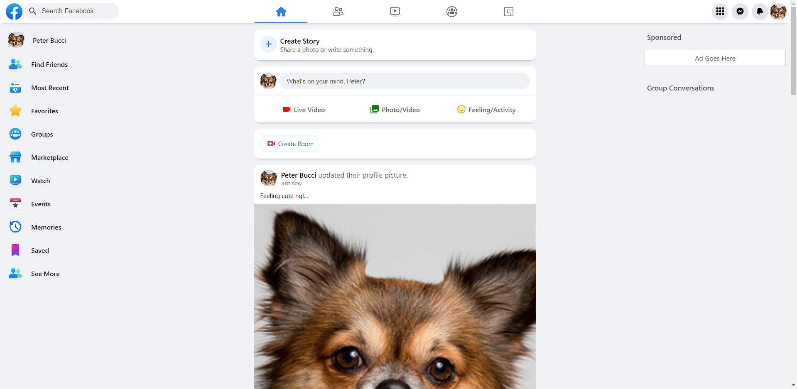
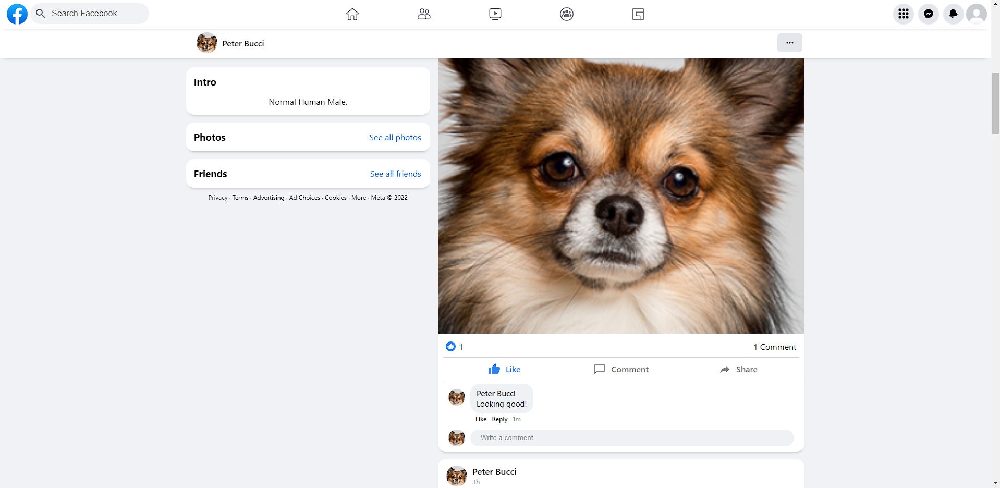

#  &nbsp;A Facebook Clone

## Table of Contents

- [Screenshots](#screenshots)
- [About](#about)
- [Installation](#installation)
- [Features](#features)
- [Links](#links)

## Screenshots

## About

To be added...

## Installation

To be added...

## Features

To be added...

## Links

- **[Demo](https://pb-project-01.web.app/)**
- **[Linkedin](https://www.linkedin.com/in/peter-bucci/)**
